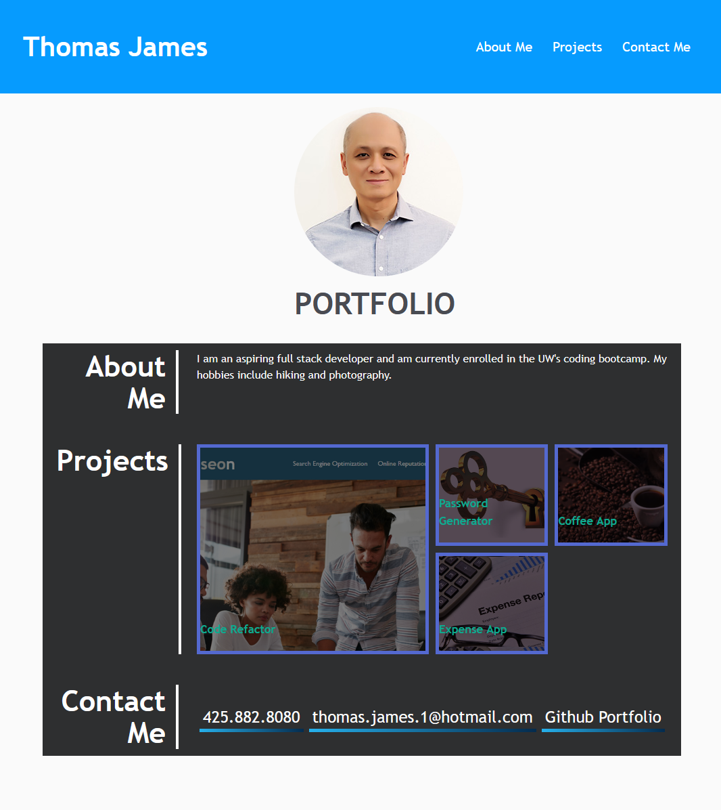

# Thomas James - Portfolio

---

## Description

- This portfolio webpage was built using HTML and CSS. The objective of this webpage is to allow visitors to view my work and to contact me should they so desire.

- This is a mobile responsive website. Users should be able to view it from a variety of devices.

## Link to the Live Webpage

https://twenty-fourseven.github.io/ThomasJames-Portfolio/

## Installation

N/A

## Authors

Created by Thomas James.
GitHub: https://github.com/Twenty-FourSeven

## Usage

The aim of this website is to showcase Thomas James's web development projects. It may be used to acess and view Thomas's web development projects, learn more about Thomas, and to contact him.

## Credits

Created by Thomas James

## License

Please refer to the LICENSE listed in the repository.