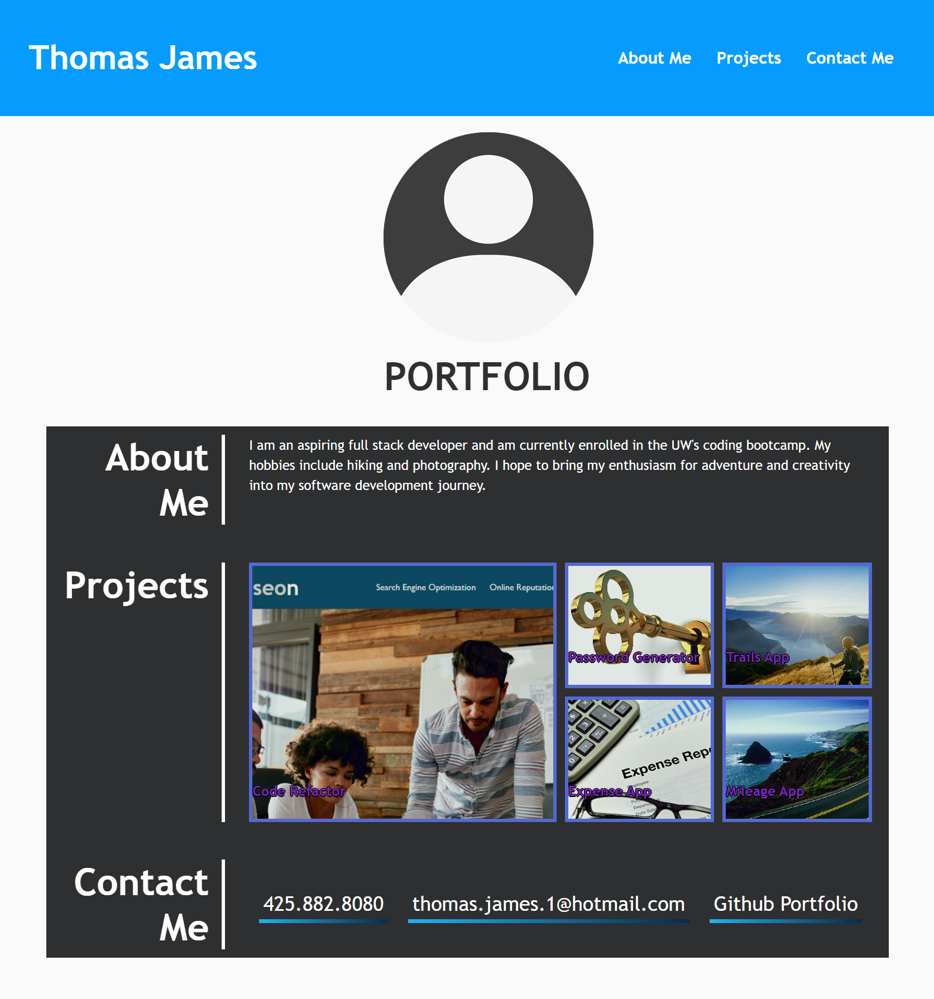

# Thomas James - Portfolio

---

## Description

A Portfolio Page that Showcases my Web Development Work.

- Portfolio shows developer's name, a recent photo or avatar, links to sections about them, their work, and how to contact them.

- Links in navigation scroll to corresponding sections.

- Link to the section about work scrolls to a section with titled images of the developer's applications.

- Image of developer's first application, when presented, should be larger in size than the other applications.

- Images of applications should link to and display deployed applications when clicked.

- Resizing of the page or viewing the site on various screens and devices reveals a responsive layout that adapts to the site visitor's viewport.

## Link to the Live Webpage

URL to the portfolio webpage: https://twenty-fourseven.github.io/portfolio/

## Authors

Created by Thomas James.
GitHub: https://github.com/Twenty-FourSeven

## Usage

The aim of this website is to showcase Thomas James's web development projects. It may be used to acess and view Thomas's web development projects, learn more about Thomas and to contact him.

## Credits

Created by Thomas James

## License

Please refer to the LICENSE listed in the repository.